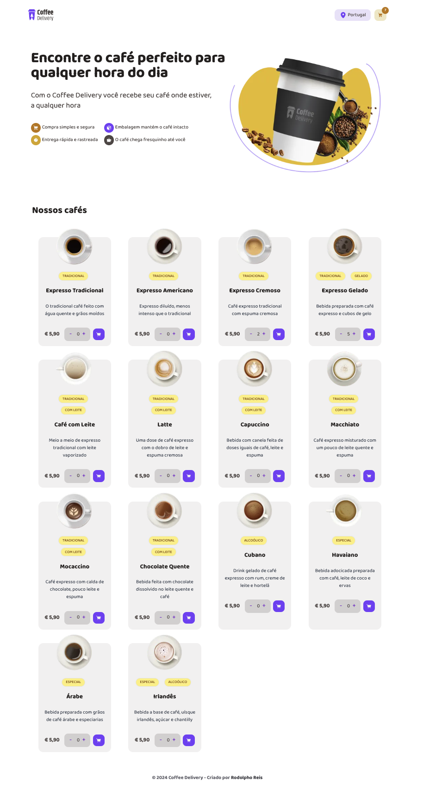
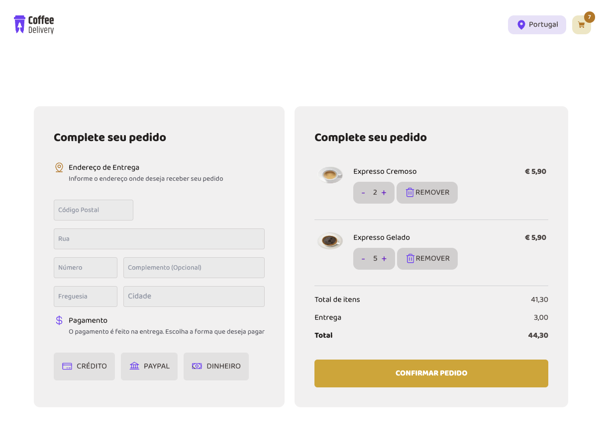
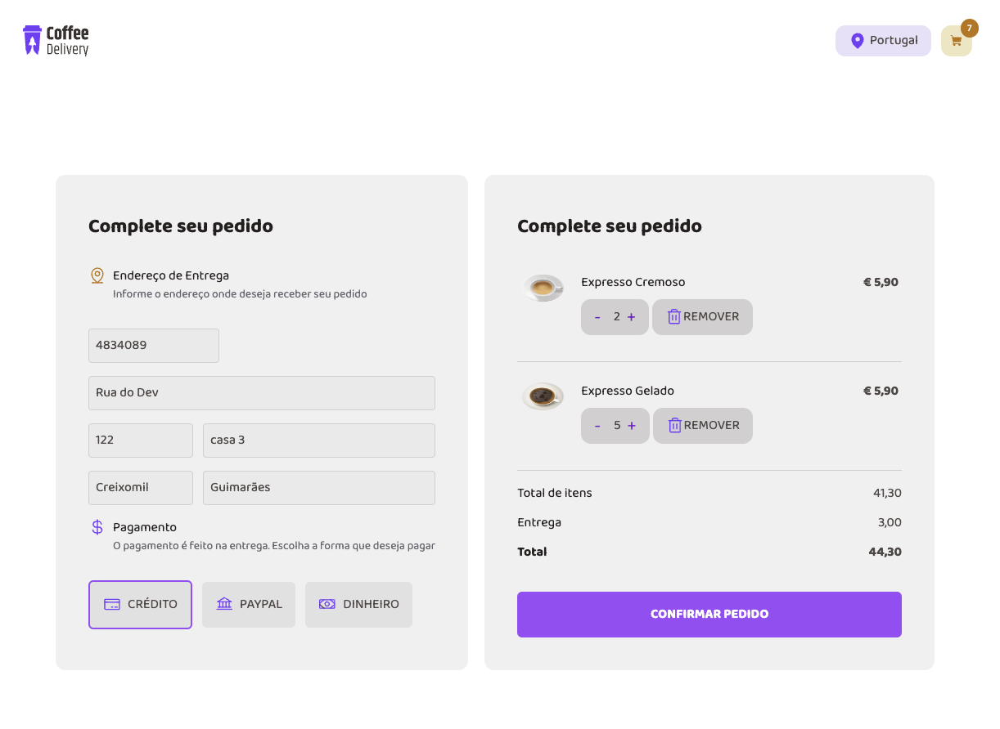
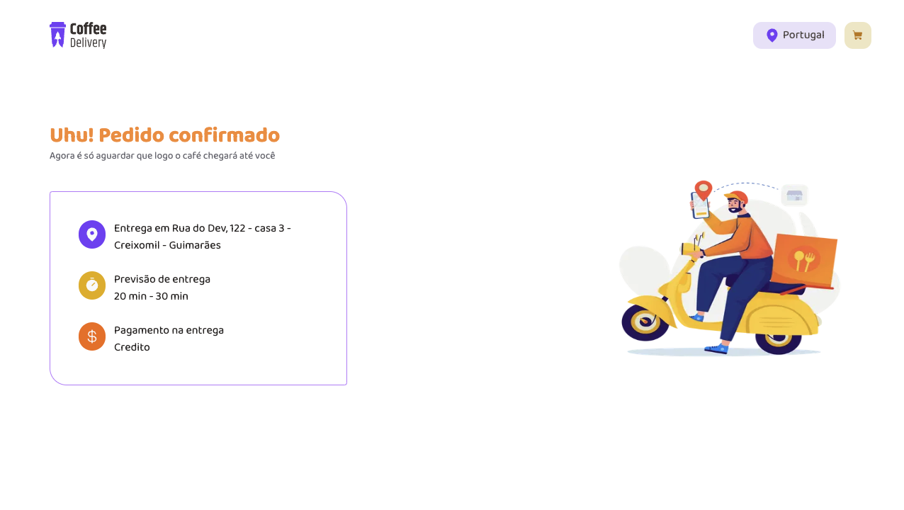

# Coffee Delivery

## Deploy
Este projeto está disponível online. Acesse a versão deployada [aqui](https://coffee-delivery-jade-rho.vercel.app/) (clique com o botão direito e escolha "Abrir link em uma nova aba").

## Instalação
Para começar a usar este projeto, siga estas etapas:
1. Clone o repositório:
   ```bash
   git clone https://github.com/rodolphoreis/coffee-delivery.git
   cd coffee-delivery
    ```

2. **Inicie o servidor de desenvolvimento:**

   ```bash
   npm install

   ```

3. **Inicie o servidor de desenvolvimento:**
    ```bash
   npm run dev

   ```
   

5. **Abra o navegador e navegue até** [http://localhost:3000](http://localhost:3000).

## Funcionalidades

- Catálogo de Produtos: Visualize uma lista de cafés disponíveis, incluindo descrição e preço.
- Carrinho de Compras: Adicione itens ao carrinho e finalize a compra.
- Métodos de Pagamento: Opções para pagamento com cartão de crédito, paypal e dinheiro.
- Formulário: Cadastro de morada para envio do pedido.

## Imagens do Projeto

  
_Home_

  
_Checkout1_

  
_Checkout2_

  
_Success_

##  Tecnologias Utilizadas

- Frontend: Next.js, TypeScript, Tailwind 
- Hospedagem: Vercel (Frontend)

## Contribuição

Contribuições são bem-vindas! Se você gostaria de contribuir para este projeto, por favor, faça um fork do repositório e envie um pull request com suas alterações.

